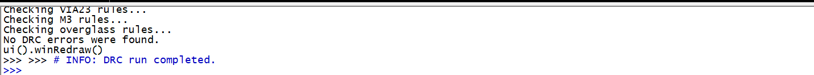
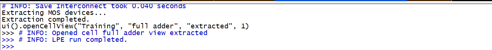

# Full Adder ; CMOS Layout in Glade

A one-bit **CMOS full adder** designed at the **transistor and layout level** in [Glade](http://www.peardrop.co.uk/glade/) on the **C5N 0.5 µm PDK**. Built bottom-up from a hand-laid library of CMOS gates (INV → NAND/NOR → AND/OR/XOR → full adder), each verified with **DRC** (design-rule check) and **LVS** (layout-vs-schematic) before being composed into the next.

This repo does not include the Glade application, the C5N PDK, or any Glade-shipped library.

[](http://www.peardrop.co.uk/glade/)
[](#)
[](#verification-results)
[](LICENSE)

<p align="center">
  <br/>
  <em>Final layout of the 1-bit CMOS full adder (C5N 0.5 µm, hand-laid in Glade).</em>
</p>

## What's in here


```
.
├── final report.docx          # written report
├── figures/                   # schematics, layouts, and LVS screenshots from the report
│
├── inverter/                  # CMOS inverter (foundational cell)
├── nand/                      # 2-input NAND
├── nor/                       # 2-input NOR
├── and/                       # 2-input AND   ( NAND + INV )
├── or/                        # 2-input OR    ( NOR  + INV )
├── xor/                       # 2-input XOR
├── full_adder/                # 1-bit full adder built from the gates above
│
├── tap/                       # standalone well/substrate tap cell
└── latch/                     # SR latch
```

### Inside each gate folder

| File                       | What it is |
|----------------------------|------------|
| `schematic.cdl`            | SPICE-like netlist of the schematic view (text — open anywhere). |
| `layout.cdl`                | Netlist generated from the layout view (text). |
| `extracted.cdl`             | Netlist back-extracted from the layout, with real transistor sizes (text). |
| `lvs.txt`                   | LVS (Layout vs. Schematic) report &mdash; *clean* means the layout matches the schematic transistor-for-transistor. |
| `glade_cellview/schematic`  | Glade binary cell view &mdash; the schematic geometry. Only openable in Glade. |
| `glade_cellview/layout`     | Glade binary cell view &mdash; the layout polygon data. Only openable in Glade. |
| `glade_cellview/extracted`  | Glade binary cell view &mdash; the back-extracted layout. Only openable in Glade. |

> The `.cdl` and `.txt` files are plain text. The files inside `glade_cellview/` are Glade binary blobs (no file extension) that carry the polygon-level geometry &mdash; only Glade can open them.

**Cells with a different shape:**
- `latch/` has only `glade_cellview/{schematic, layout, extracted}` &mdash; no netlist export.
- `tap/` has only `glade_cellview/layout` &mdash; a standalone well/substrate tap cell, no schematic counterpart.


## Gates in detail

### AND gate

<table>
<tr>
<td width="50%" valign="top"></td>
<td width="50%" valign="top"></td>
</tr>
<tr>
<td align="center"><em>AND schematic</em></td>
<td align="center"><em>AND transistor-level layout (C5N 0.5 µm)</em></td>
</tr>
</table>

### OR gate

<table>
<tr>
<td width="50%" valign="top"></td>
<td width="50%" valign="top"></td>
</tr>
<tr>
<td align="center"><em>OR schematic</em></td>
<td align="center"><em>OR transistor-level layout</em></td>
</tr>
</table>

### XOR gate

<table>
<tr>
<td width="50%" valign="top"></td>
<td width="50%" valign="top"></td>
</tr>
<tr>
<td align="center"><em>XOR schematic</em></td>
<td align="center"><em>XOR transistor-level layout</em></td>
</tr>
</table>

### Full adder

<table>
<tr>
<td width="50%" valign="top"></td>
<td width="50%" valign="top"></td>
</tr>
<tr>
<td align="center"><em>Full-adder schematic &mdash; composed from the verified gates</em></td>
<td align="center"><em>Full-adder layout &mdash; the polygon-level assembly that ties out to <code>SUM</code> and <code>CARRY</code></em></td>
</tr>
</table>

## Verification

Every cell is run through the full **DRC → LPE → LVS** sign-off flow before being reused in a higher-level block. All three steps come back clean for every gate and for the assembled full adder.

### 1. DRC &mdash; Design-Rule Check

DRC scans the layout polygons against the C5N PDK's geometric rules (minimum width, spacing, enclosure, antenna, overlap, etc.). A run that finishes with **"No DRC errors were found"** means the layout is manufacturable.

<p align="center">
  <br/>
  <em>DRC sign-off on the full adder &mdash; "No DRC errors were found" across every layer (VIA23, M3, overglass, etc.).</em>
</p>

### 2. LPE &mdash; Layout Parameter Extraction

LPE walks the layout, recognises the transistor patterns, and writes a **device-level netlist back out** with real W/L sizing and source/drain area &amp; perimeter parasitics. This extracted netlist is what LVS compares against the schematic.

<p align="center">
  <br/>
  <em>LPE completes on the full adder &mdash; MOS devices extracted and the <code>extracted</code> cellview is opened for inspection.</em>
</p>

The text netlists this produces are in each gate folder as `extracted.cdl`.

### 3. LVS &mdash; Layout vs. Schematic

LVS feeds the extracted netlist into the Gemini engine and compares it, device-for-device, against the schematic netlist. A clean run means the layout you drew implements exactly the circuit you intended.

<p align="center">
  <br/>
  <em>Gemini LVS engine reports a clean match on the full adder (<code>exit code 0</code>).</em>
</p>

### Summary

| Cell           | DRC   | LPE   | LVS   | Devices (after reduction) | LVS report                                |
|----------------|:-----:|:-----:|:-----:|---------------------------|-------------------------------------------|
| Inverter       | clean | done  | clean | 2                         | [`inverter/lvs.txt`](inverter/lvs.txt)    |
| NAND           | clean | done  | clean | 4                         | [`nand/lvs.txt`](nand/lvs.txt)            |
| NOR            | clean | done  | clean | 4                         | [`nor/lvs.txt`](nor/lvs.txt)              |
| AND            | clean | done  | clean | 6                         | [`and/lvs.txt`](and/lvs.txt)              |
| OR             | clean | done  | clean | 6                         | [`or/lvs.txt`](or/lvs.txt)                |
| XOR            | clean | done  | clean | 12                        | [`xor/lvs.txt`](xor/lvs.txt)              |
| **Full adder** | clean | done  | **clean** | **35** (42 before reduction) | [`full_adder/lvs.txt`](full_adder/lvs.txt) |


## Note &mdash; running this yourself

This repo is a **showcase of my work**, not a turn-key Glade project. To open the cells and re-run DRC / LPE / LVS yourself you also need:

1. **Glade** &mdash; download free for academic use from [peardrop.co.uk/glade](http://www.peardrop.co.uk/glade/). The Glade base library (pins, supplies) ships with the install.
2. **The C5N PDK** &mdash; the technology file (`C5N.tch`), DRC / LPE rule decks (`C5N_DRC.py`, `C5N_EXT_LVS.py`), device pcells (`C5NNMOS.py`, `C5NPMOS.py`), and SPICE models (`engr3426.sub`). These are educational files based on the **[MOSIS SCMOS3ME_SUBM scalable design rules](https://www.mosis.com/files/scmos/scmos.pdf)** and were provided through the ENGR3426 course at PSUT. Drop them into a `tech/ENGR3426_mod/` folder next to the cell folders.

Without the PDK, Glade can still **open** the binary cell views, and the `.cdl` netlists and `.txt` LVS reports are fully readable in any text editor &mdash; but the layout layers won't be coloured correctly and verification can't be re-run.

## Author

**Leen Almousa** &mdash; [github.com/leenalmousa](https://github.com/leenalmousa)

## License

Released under the [MIT License](LICENSE).
