# Full Adder &mdash; CMOS Layout in Glade

A one-bit **CMOS full adder** designed at the **transistor and layout level** in [Glade](http://www.peardrop.co.uk/glade/) on the **C5N 0.5 µm PDK**. Built bottom-up from a hand-laid library of CMOS gates (INV → NAND/NOR → AND/OR/XOR → full adder), each verified with **DRC** (design-rule check) and **LVS** (layout-vs-schematic) before being composed into the next.

This repo contains **only my work** &mdash; the cells I drew, the netlists I exported, and the LVS reports I generated. It does not include the Glade application, the C5N PDK, or any Glade-shipped library.

[](http://www.peardrop.co.uk/glade/)
[](#)
[](#verification-results)
[](LICENSE)

<p align="center">
  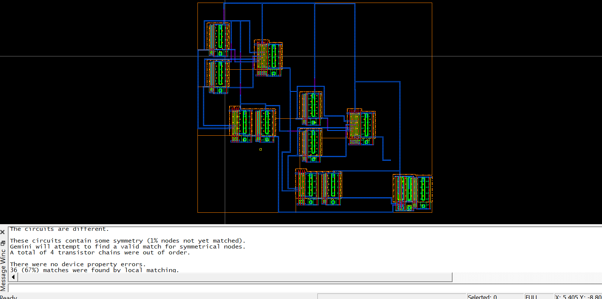<br/>
  <em>Final layout of the 1-bit CMOS full adder (C5N 0.5 µm, hand-laid in Glade).</em>
</p>

## What's in here

One folder per cell I built. Same file naming inside each folder.

```
.
├── final report.docx          # written report
├── figures/                   # schematics, layouts, and LVS screenshots from the report
│
├── inverter/                  # CMOS inverter (foundational cell)
├── nand/                      # 2-input NAND
├── nor/                       # 2-input NOR
├── and/                       # 2-input AND   ( NAND + INV )
├── or/                        # 2-input OR    ( NOR  + INV )
├── xor/                       # 2-input XOR
├── full_adder/                # 1-bit full adder built from the gates above
│
├── tap/                       # standalone well/substrate tap cell
└── latch/                     # SR latch
```

### Inside each gate folder

| File                       | What it is |
|----------------------------|------------|
| `schematic.cdl`            | SPICE-like netlist of the schematic view (text — open anywhere). |
| `layout.cdl`                | Netlist generated from the layout view (text). |
| `extracted.cdl`             | Netlist back-extracted from the layout, with real transistor sizes (text). |
| `lvs.txt`                   | LVS (Layout vs. Schematic) report &mdash; *clean* means the layout matches the schematic transistor-for-transistor. |
| `glade_cellview/schematic`  | Glade binary cell view &mdash; the schematic geometry. Only openable in Glade. |
| `glade_cellview/layout`     | Glade binary cell view &mdash; the layout polygon data. Only openable in Glade. |
| `glade_cellview/extracted`  | Glade binary cell view &mdash; the back-extracted layout. Only openable in Glade. |

> The `.cdl` and `.txt` files are plain text. The files inside `glade_cellview/` are Glade binary blobs (no file extension) that carry the polygon-level geometry &mdash; only Glade can open them.

**Cells with a different shape:**
- `latch/` has only `glade_cellview/{schematic, layout, extracted}` &mdash; no netlist export.
- `tap/` has only `glade_cellview/layout` &mdash; a standalone well/substrate tap cell, no schematic counterpart.

## Approach

The full adder is built bottom-up from CMOS primitives:

<p align="center">
  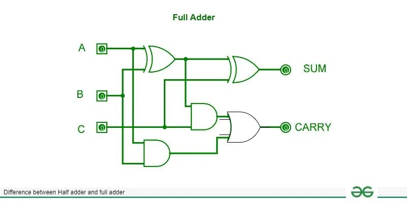<br/>
  <em>Standard one-bit full adder: 2 XOR + 2 AND + 1 OR producing <code>SUM</code> and <code>CARRY</code>.</em>
</p>

```
sum  = a XOR b XOR c_in
cout = (a AND b) OR (c_in AND (a XOR b))
```

Each CMOS gate is laid out at the polygon level. The library is built bottom-up: NAND/NOR from inverters and series/parallel transistors, then AND = NAND + INV, OR = NOR + INV, and XOR. Below is the stick diagram used to plan the AND gate &mdash; a NAND followed by an inverter:

<p align="center">
  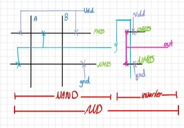<br/>
  <em>Stick-diagram planning of the AND gate: a NAND with the inputs and gnd/Vdd rails, followed by an inverter.</em>
</p>

**Substrate / well taps** are placed inside every cell so every transistor's body terminal is tied (NMOS body → gnd, PMOS body → VDD). A standalone `tap` cell is also provided in [`tap/`](tap/) to drop extra ties wherever a larger design needs them.

## Gates in detail

### AND gate

<table>
<tr>
<td width="50%" valign="top">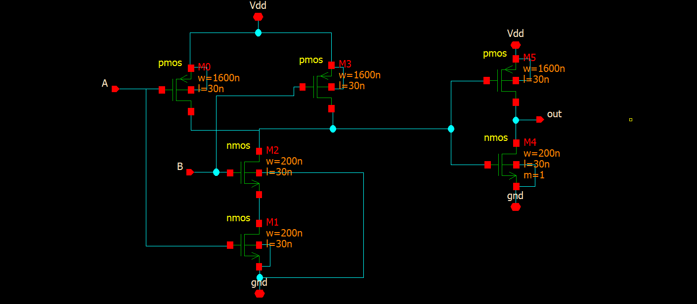</td>
<td width="50%" valign="top">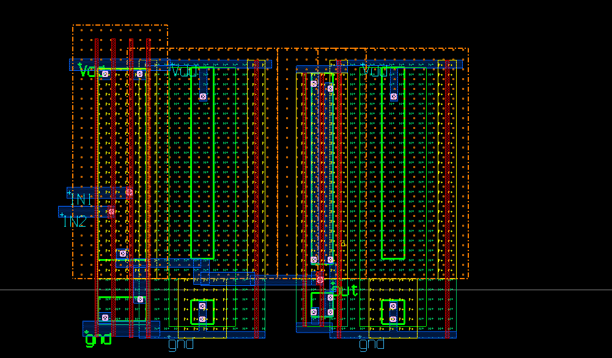</td>
</tr>
<tr>
<td align="center"><em>AND schematic</em></td>
<td align="center"><em>AND transistor-level layout (C5N 0.5 µm)</em></td>
</tr>
</table>

### OR gate

<table>
<tr>
<td width="50%" valign="top">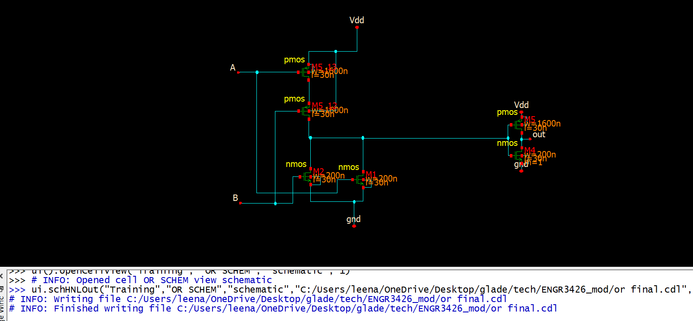</td>
<td width="50%" valign="top">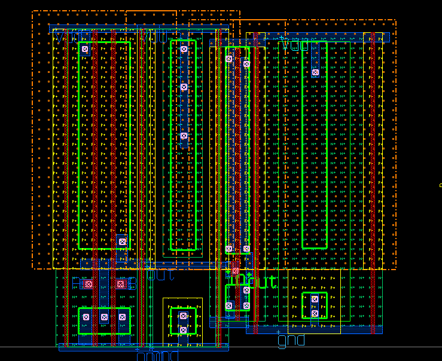</td>
</tr>
<tr>
<td align="center"><em>OR schematic</em></td>
<td align="center"><em>OR transistor-level layout</em></td>
</tr>
</table>

### XOR gate

<table>
<tr>
<td width="50%" valign="top">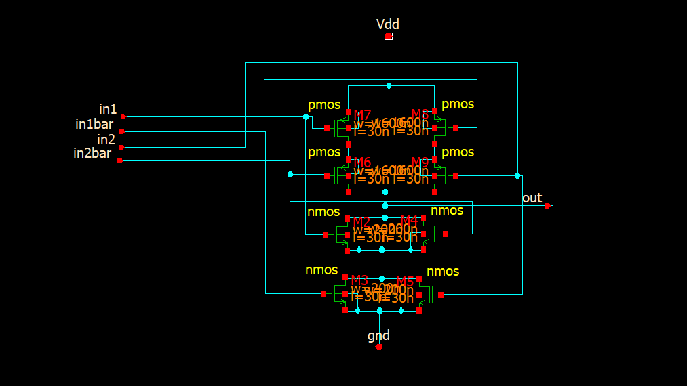</td>
<td width="50%" valign="top">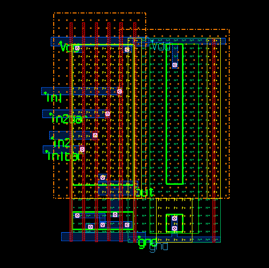</td>
</tr>
<tr>
<td align="center"><em>XOR schematic</em></td>
<td align="center"><em>XOR transistor-level layout</em></td>
</tr>
</table>

### Full adder

<table>
<tr>
<td width="50%" valign="top">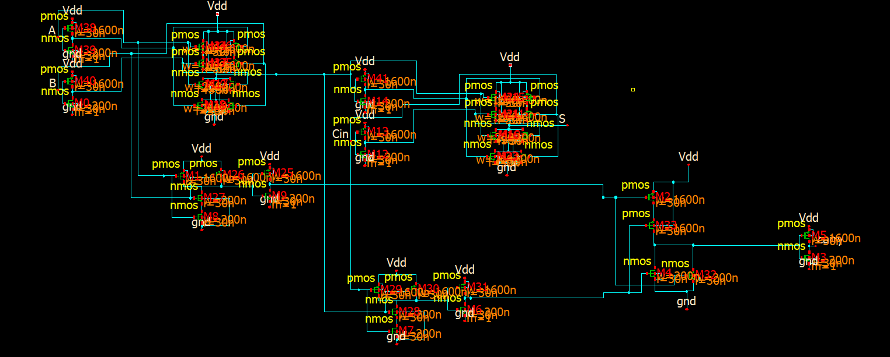</td>
<td width="50%" valign="top"></td>
</tr>
<tr>
<td align="center"><em>Full-adder schematic &mdash; composed from the verified gates</em></td>
<td align="center"><em>Full-adder layout &mdash; the polygon-level assembly that ties out to <code>SUM</code> and <code>CARRY</code></em></td>
</tr>
</table>

## Verification results

Every cell passes **LVS clean** &mdash; the extracted layout matches the schematic transistor-for-transistor.

<p align="center">
  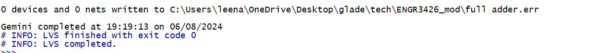<br/>
  <em>Gemini LVS engine reports a clean match on the full adder (<code>exit code 0</code>).</em>
</p>

| Cell           | Devices (after reduction) | LVS report                                |
|----------------|---------------------------|-------------------------------------------|
| Inverter       | 2                         | [`inverter/lvs.txt`](inverter/lvs.txt)    |
| NAND           | 4                         | [`nand/lvs.txt`](nand/lvs.txt)            |
| NOR            | 4                         | [`nor/lvs.txt`](nor/lvs.txt)              |
| AND            | 6                         | [`and/lvs.txt`](and/lvs.txt)              |
| OR             | 6                         | [`or/lvs.txt`](or/lvs.txt)                |
| XOR            | 12                        | [`xor/lvs.txt`](xor/lvs.txt)              |
| **Full adder** | **35** (42 before reduction) | [`full_adder/lvs.txt`](full_adder/lvs.txt) |

The full adder's extracted netlist contains 42 raw transistors that reduce to **35** after series/parallel collapse, with **18 internal nets** matching the schematic. Body terminals are tied for all 42 transistors (21 NMOS to `gnd`, 21 PMOS to `VDD`).

## Course context

Built for **ENGR3426 (Digital Electronics / VLSI Design)** at PSUT. Demonstrates the full custom-layout flow on a textbook PDK: cell-library construction, hierarchical schematic/layout, DRC, LVS, and post-layout netlist extraction.

## Author

**Leen Almousa** &mdash; [github.com/leenalmousa](https://github.com/leenalmousa)

## License

Released under the [MIT License](LICENSE).
